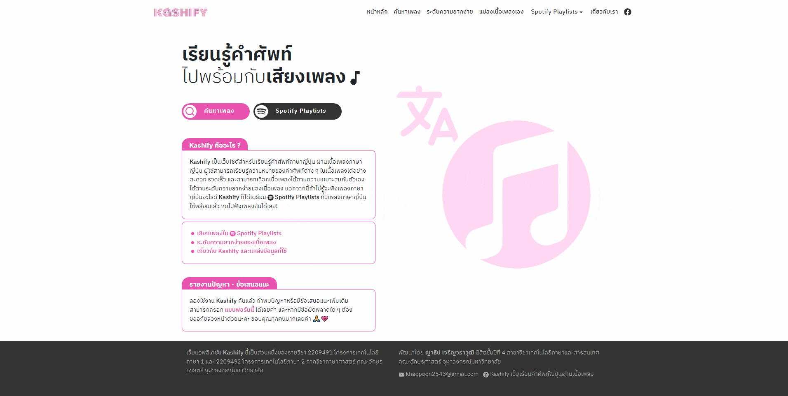

Let's go to Kashify!(new link) 🎶💗 https://kashify.onrender.com
This repository is a frontend repository. Go to this link for more details on the backend 💻 https://github.com/khaopoon2543/myproject-backend 

## What is Kashify?

Kashify is Web Application learning Japanese words through lyrics. Users can learn Thai and English meaning of Japanese words in the lyrics conveniently and quickly.

## Project Presentation

